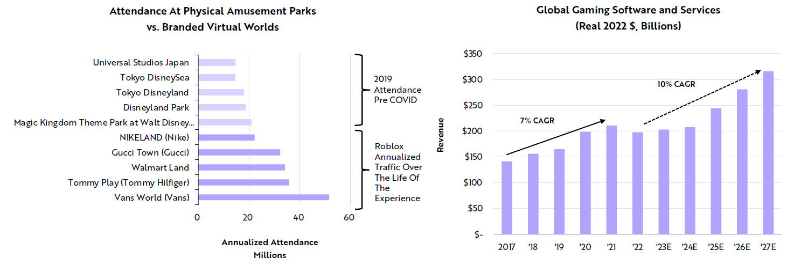

# Next Wave of Gaming

As the gaming industry transitions to full-service virtual worlds, video games and social media could merge as consumers socialize and entertain in game-supported virtual spaces, at the expense of physical environments.&#x20;

According to ARK’s research, the convergence between gaming and social media should boost the growth in gaming revenue from 7% at a compound annual rate during the past five years to 10% during the next five years.

<figure><figcaption></figcaption></figure>

