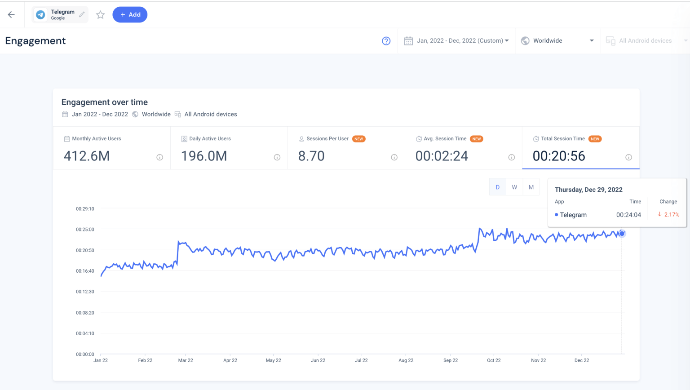

# Market Analysis

## Most engaging messaging apps of 2023

TG’s focus on privacy has seen it perform consistently over the year. While it claims the third spot overall, it ranks within the top five apps in 21/100 countries, and in the top ten in 53/100 countries.



## TG’s users by country: 2023

<figure><figcaption></figcaption></figure>

## TG’s users engagement: 2022

TG’s engagement rising over the course of 2022. At the start of the year, the average time users spend on the app daily has risen steadily from just under 16 minutes to 24 minutes; equating to a 150% increase in just 12 months.

<figure><figcaption></figcaption></figure>

## TG Demographic distribution

Males account for 62.1% and females account for 37.9% of the target audience. The age distribution is mainly between 25-34 years old (35.1%), followed by 18-24 years old (28.9%) and 35-44 years old (17.2%)

## Top 3 Countries with highest TG MAU

•India (165 million), Russia (91 million), Indonesia (45 million).•

## Top 3 Countries with highest purchasing power (over 100 thousands/month)

•Russia (285 thousands), United States (240 thousands), Ukraine (220 thousands)
