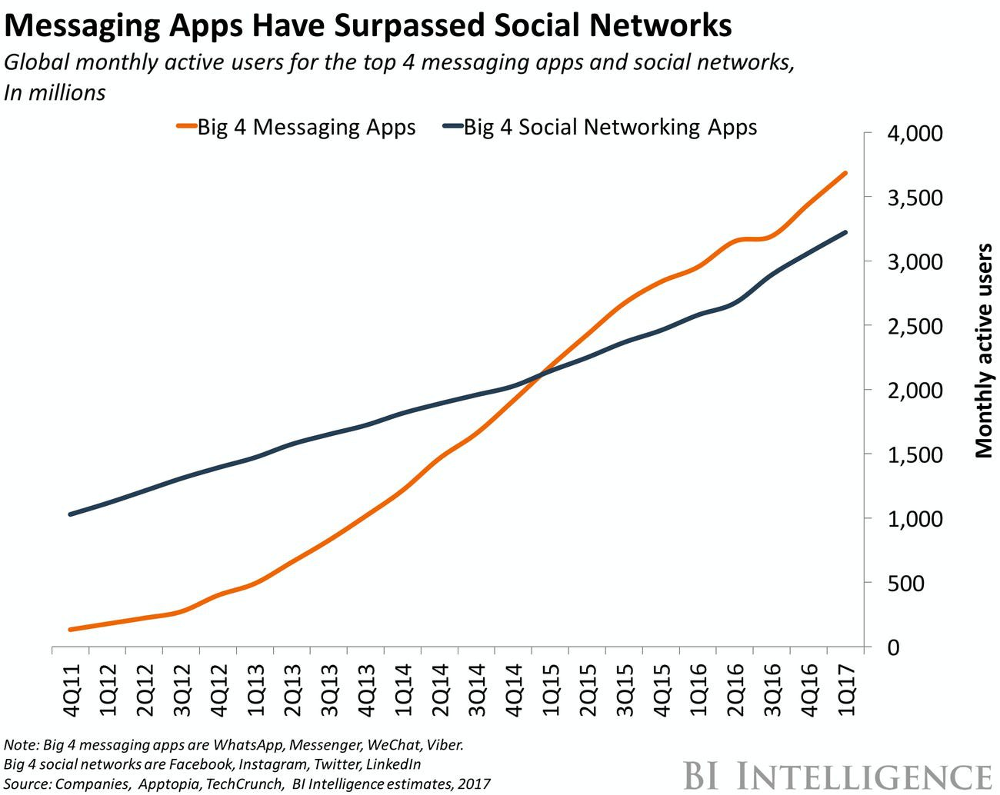

# Start from IM, next gen of internet service provider

* Popular app type: Over 3 billion people have used messaging apps in 2021.&#x20;
* Popularity: Messaging apps first surpassed social networks starting 2015.

<figure><figcaption></figcaption></figure>

<figure><figcaption></figcaption></figure>
