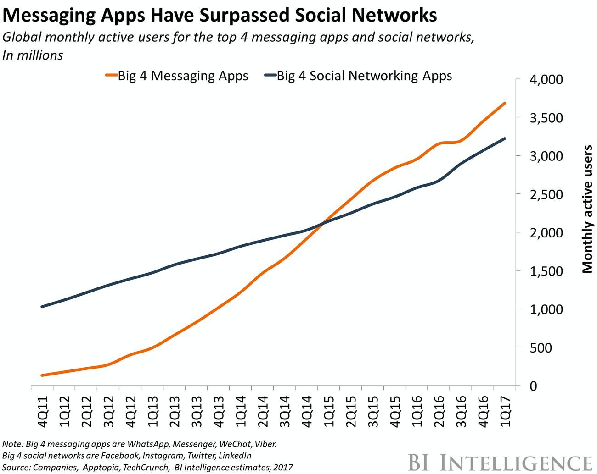

# Start from IM, next gene of internet service provider

* Real-time: A smoother and faster communication between users.
* Personalization: Easier for users to find content and communities that interest them.
* Convenience: A relaxed and effortless communication such as voice messages and emojis.

<figure><figcaption></figcaption></figure>
